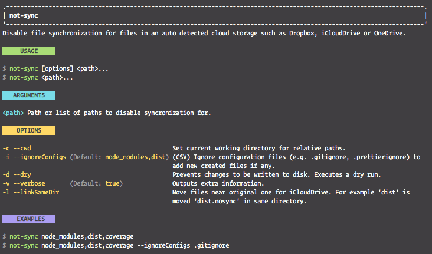
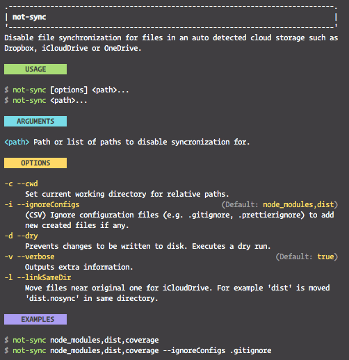

# Features

- Generates help text without effort. See images below.
- Provides common flags. (`--help` and `--version`)
- `meow` throws unknown flags with the `allowUnknownFlags` option. `meow-helper` shows help text instead of throwing. You can change this behavior with the `notThrow` option.
- Formats, colorizes, and aligns arguments, options, default values, and their descriptions.
- Marks required fields with an `*`.
- Supports maximum line length and automatic word wrap.
- Splits options into two lines if space for description is too small. You can change this behavior with the `multilineThreshold` option.
- Generates description, usage, arguments, flags/options, examples sections.
- Colorizes command in usage and examples and adds `$` before command.
- Exports [chalk](https://www.npmjs.com/package/chalk) and [cliui](https://www.npmjs.com/package/cliui).
- Supports both `{ autoHelp: true }` and `{ autoHelp: false }`. Adds a description to help if required.
- Moves three dots in arguments outside of brackets. For example: `args: { “path...” }` becomes `command <path>...`
- Adds three dots `...` to flags with multiple value.

# Synopsis

**TypeScript**

```ts
import getHelp, { commonFlags, chalk, cliui } from "meow-helper";
import type { ExtendedAnyFlags } from "meow-helper";
import { readFileSync } from "fs";
import { join } from "path";
```

**CommonJS**

```js
const { default: getHelp, commonFlags, chalk, cliui } = require("meow-helper");
const { readFileSync } = require("fs");
```

**Usage**

```ts
const flags: ExtendedAnyFlags = {
  name: { alias: "n", type: "string", desc: "Name" },
  cwd: { alias: "c", type: "string", desc: "Working path." },
  context: { type: "string", desc: "Context." },
  ...commonFlags,
};

// Groups options. Keys are the first option of the group.
const groups = {
  name: { title: "General Options", description: "Some description" },
  context: { title: "Other Options", description: "Other description" },
};

const args = { "path...": "Paths of files." };
const pkg = JSON.parse(readFileSync(join(__dirname, "../package.json"), { encoding: "utf8" }));

meow(getHelp({ flags, args, groups, pkg }), { flags, pkg, allowUnknownFlags: false });
```

```ts
const help = getHelp({
  lineLength: 80,
  titleLength: 15,
  pkg: {}, // package.json data
  command: "not-sync",
  description: "Description of the command",
  args: { path: "Path of file." },
  flags, // meow flags with `desc` key.
  examples: ["not-sync node_modules,dist,coverage", "not-sync node_modules,dist,coverage --ignoreConfigs .gitignore"],
  multilineThreshold: 50,
  autoHelp: true,
  notThrow: true,
});
```

# Details

`meow-helper` generates single-line or multi-line help text based on the `multilineThreshold` option automatically.

## Single-Line



## Multi-Line



<!-- usage -->

<!-- commands -->

# API

<a name="readmemd"></a>

## Table of contents

### Interfaces

- [HelpOptions](#interfaceshelpoptionsmd)

## Type aliases

### ExtendedAnyFlag

Ƭ **ExtendedAnyFlag**: AnyFlag & { `desc?`: _string_ }

Meow flag extended with `desc` key.

Defined in: [get-help.ts:8](https://github.com/ozum/meow-helper/blob/bcfac89/src/get-help.ts#L8)

---

### ExtendedAnyFlags

Ƭ **ExtendedAnyFlags**: _Record_<string, [_ExtendedAnyFlag_](#extendedanyflag)\>

Record of extended any flag.

Defined in: [get-help.ts:11](https://github.com/ozum/meow-helper/blob/bcfac89/src/get-help.ts#L11)

## Variables

### cliui

• `Const` **cliui**: _any_

Defined in: [index.ts:5](https://github.com/ozum/meow-helper/blob/bcfac89/src/index.ts#L5)

---

### commonFlags

• `Const` **commonFlags**: [_ExtendedAnyFlags_](#extendedanyflags)

Very common flags

Defined in: [index.ts:12](https://github.com/ozum/meow-helper/blob/bcfac89/src/index.ts#L12)

## Functions

### default

▸ **default**(`helpOptions`: [_HelpOptions_](#interfaceshelpoptionsmd)): _string_

Generate help text for meow.

#### Example

```typescript
const flags: ExtendedFlags = { cwd: { alias: "c", type: "string", desc: "Current CWD." }, ...commonFlags };
const args = { path: "Path of file." };

meow(getHelp({ flags, args, pkg }), { flags, pkg, allowUnknownFlags: false });
```

#### Parameters:

| Name          | Type                                      | Description |
| :------------ | :---------------------------------------- | :---------- |
| `helpOptions` | [_HelpOptions_](#interfaceshelpoptionsmd) | are options |

**Returns:** _string_

Defined in: [get-help.ts:193](https://github.com/ozum/meow-helper/blob/bcfac89/src/get-help.ts#L193)

# Interfaces

<a name="interfaceshelpoptionsmd"></a>

[meow-helper](#readmemd) / HelpOptions

# Interface: HelpOptions

Options below modify behaviour of [[getHelp]] function.

## Properties

### args

• `Optional` **args**: _Record_<string, string\>

Name and description of positional arguments.

Defined in: [get-help.ts:28](https://github.com/ozum/meow-helper/blob/bcfac89/src/get-help.ts#L28)

---

### autoHelp

• `Optional` **autoHelp**: _boolean_

This option sets whether the `autoHelp` option of `meow` is used. If this is true, the description text is not added, because meow adds it automatically.

Defined in: [get-help.ts:36](https://github.com/ozum/meow-helper/blob/bcfac89/src/get-help.ts#L36)

---

### command

• `Optional` **command**: _string_

Name of the command.

Defined in: [get-help.ts:22](https://github.com/ozum/meow-helper/blob/bcfac89/src/get-help.ts#L22)

---

### description

• `Optional` **description**: _string_ \| _string_[]

Command description.

Defined in: [get-help.ts:24](https://github.com/ozum/meow-helper/blob/bcfac89/src/get-help.ts#L24)

---

### examples

• `Optional` **examples**: _string_ \| _string_[]

A single example or list of examples can be provided to show in the help text. Lines are prefixed with `$` and the command is colored automatically.

Defined in: [get-help.ts:32](https://github.com/ozum/meow-helper/blob/bcfac89/src/get-help.ts#L32)

---

### flags

• `Optional` **flags**: [_ExtendedAnyFlags_](#extendedanyflags)

Flags provided to meow. Uses `desc` key for the description.

Defined in: [get-help.ts:30](https://github.com/ozum/meow-helper/blob/bcfac89/src/get-help.ts#L30)

---

### groups

• `Optional` **groups**: _Record_<string, { `description?`: _string_ ; `title?`: _string_ }\>

Option groups shown in help text. Key is the first option in group.

Defined in: [get-help.ts:40](https://github.com/ozum/meow-helper/blob/bcfac89/src/get-help.ts#L40)

---

### lineLength

• `Optional` **lineLength**: _number_

Text longer than line length will be word-wrapped.

Defined in: [get-help.ts:16](https://github.com/ozum/meow-helper/blob/bcfac89/src/get-help.ts#L16)

---

### multilineThreshold

• `Optional` **multilineThreshold**: _number_

If space available for option descriptions is less than this threshold, descriptions are given their own rows. So they have more space. See images above.

Defined in: [get-help.ts:34](https://github.com/ozum/meow-helper/blob/bcfac89/src/get-help.ts#L34)

---

### notThrow

• `Optional` **notThrow**: _boolean_

Whether to throw an error when `meow` exits with exit code 2. If true, it adds `process.on("exit")` to show help and exits with code 0.

Defined in: [get-help.ts:38](https://github.com/ozum/meow-helper/blob/bcfac89/src/get-help.ts#L38)

---

### pkg

• `Optional` **pkg**: _Record_<string, any\>

`package.json` data.

Defined in: [get-help.ts:20](https://github.com/ozum/meow-helper/blob/bcfac89/src/get-help.ts#L20)

---

### titleLength

• `Optional` **titleLength**: _number_

The total length of the colored background area of titles.

Defined in: [get-help.ts:18](https://github.com/ozum/meow-helper/blob/bcfac89/src/get-help.ts#L18)

---

### usage

• `Optional` **usage**: _string_ \| _string_[]

Uasge text is shown at the beginning of help text. Lines are prefixed with `$` and command is colored automatically.

Defined in: [get-help.ts:26](https://github.com/ozum/meow-helper/blob/bcfac89/src/get-help.ts#L26)
